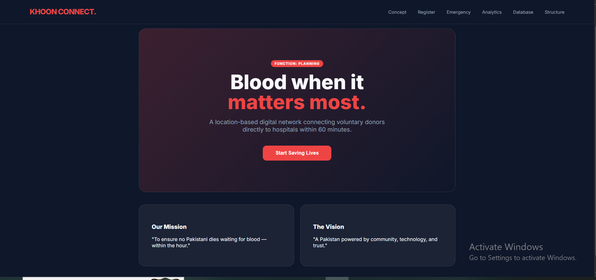
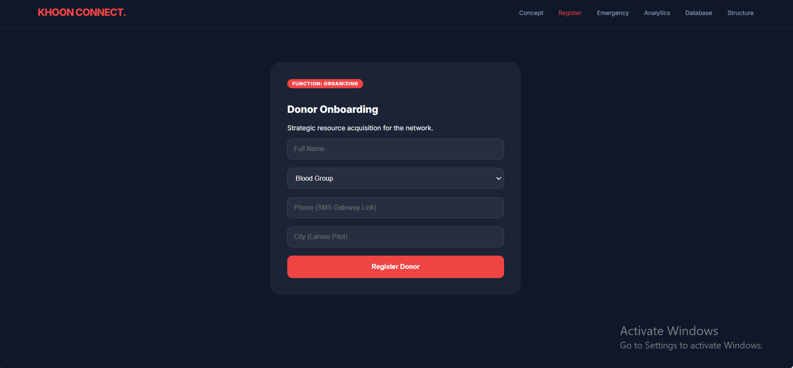

# Khoon Connect

A beginner web development project designed to connect voluntary blood donors with people who need blood during emergencies.

## Features

- Donor registration
- Blood group selection
- Emergency blood request section
- Donor database
- Donor analytics
- Browser-based data storage
- Simple navigation between different sections

## Technologies Used

- HTML
- CSS
- JavaScript
- Browser Local Storage

## Project Purpose

This project was developed as part of my early Software Engineering studies to practice web development, user interfaces, JavaScript functionality, and browser-based data handling.

## Live Demo

[View Khoon Connect](YOUR-GITHUB-PAGES-LINK)

## Screenshots

### Homepage

### Donor Registration

